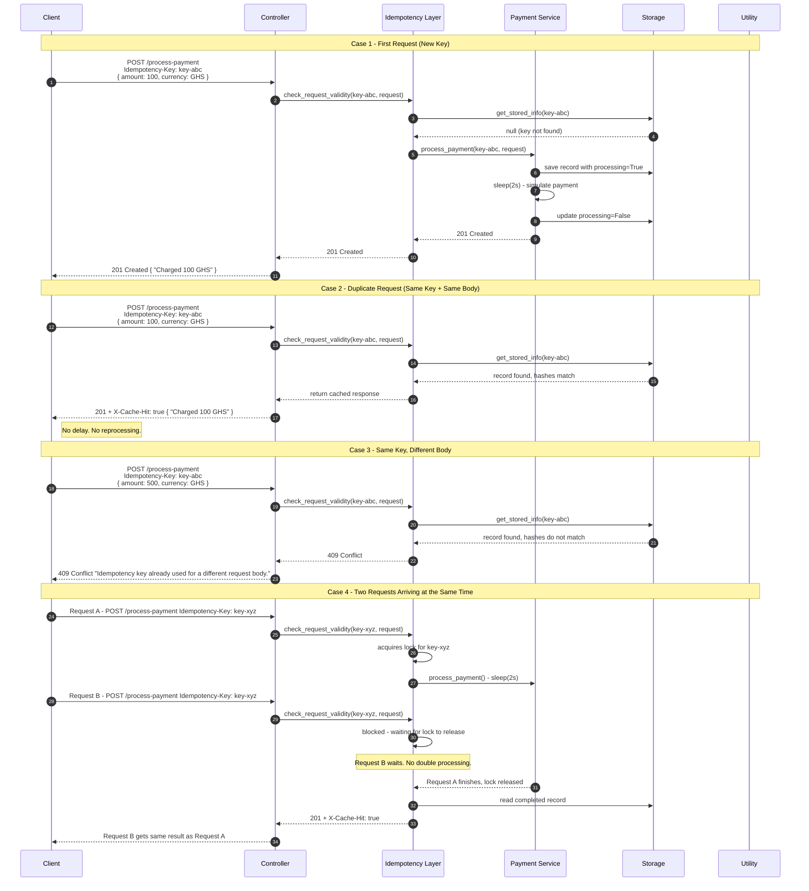

# Idempotency Gateway - Pay-Once Protocol

A REST API that guarantees payment requests are processed exactly once, even when clients retry due to network timeouts or failures.

Built with **Python + FastAPI**. No external database needed.

---

## Architecture Diagram



---

## Project Structure

```
Idempotency-Gateway/
├── main.py                    # Entry point - starts the server
├── requirements.txt           # Project dependencies
├── Controller/
│   ├── __init__.py
│   └── PaymentController.py   # Handles HTTP requests and responses
├── Service/
│   ├── __init__.py
│   ├── IdempotencyLayer.py    # Checks keys and decides what to do
│   └── PaymentService.py      # Simulates the actual payment
├── Storage/
│   ├── __init__.py
│   └── InfoStorage.py         # Keeps records in memory
├── DTOs/
│   ├── __init__.py
│   ├── PaymentRequest.py      # Shape of the incoming request
│   └── StoredInfo.py          # Shape of a stored record
└── Utility/
    ├── __init__.py
    └── Util.py                # Hashing and automatic key cleanup
```

---

## Setup and Running

### Requirements

- Python 3.11 or higher
- pip

### Steps

```bash
# 1. Clone the repo
git clone https://github.com/your-username/Idempotency-Gateway.git
cd Idempotency-Gateway

# 2. Install dependencies
pip install -r requirements.txt

# 3. Start the server
uvicorn main:app --reload
```

Server runs at **http://localhost:8000**

Interactive docs available at: http://localhost:8000/docs

---

## API Documentation

### POST /process-payment

**Headers**

| Header | Required | Description |
|---|---|---|
| `Idempotency-Key` | Yes | A unique string for each payment (UUID recommended) |
| `Content-Type` | Yes | application/json |

**Request Body**

```json
{
  "amount": 100,
  "currency": "GHS"
}
```

**Responses**

| Status | When | Description |
|---|---|---|
| `201 Created` | New key | Payment processed successfully |
| `201 + X-Cache-Hit: true` | Same key, same body | Cached response returned, no reprocessing |
| `409 Conflict` | Same key, different body | Request rejected to protect data integrity |
| `422 Unprocessable Entity` | Missing header or invalid body | Validation failed |

---

### Example Requests

**First payment**

```bash
curl -X POST http://localhost:8000/process-payment \
  -H "Idempotency-Key: key-001" \
  -H "Content-Type: application/json" \
  -d '{"amount": 100, "currency": "GHS"}'
```

Response:
```
201 Created
"Charged 100 GHS"
```

**Retry the same payment**

```bash
curl -si -X POST http://localhost:8000/process-payment \
  -H "Idempotency-Key: key-001" \
  -H "Content-Type: application/json" \
  -d '{"amount": 100, "currency": "GHS"}'
```

Response:
```
201 Created
X-Cache-Hit: true
"Charged 100 GHS"
```

**Same key, different amount**

```bash
curl -X POST http://localhost:8000/process-payment \
  -H "Idempotency-Key: key-001" \
  -H "Content-Type: application/json" \
  -d '{"amount": 500, "currency": "GHS"}'
```

Response:
```
409 Conflict
"Idempotency key already used for a different request body."
```

**Two requests at the same time**

```bash
curl -X POST http://localhost:8000/process-payment \
  -H "Idempotency-Key: key-race" \
  -H "Content-Type: application/json" \
  -d '{"amount": 250, "currency": "USD"}' &

curl -X POST http://localhost:8000/process-payment \
  -H "Idempotency-Key: key-race" \
  -H "Content-Type: application/json" \
  -d '{"amount": 250, "currency": "USD"}' &

wait
```

Both return the same `201` response. Only one payment goes through.

---

## Design Decisions

### Per-key threading lock

Each idempotency key gets its own lock inside `IdempotencyLayer`. This means two requests with different keys run at the same time without blocking each other. Two requests with the same key run one after the other so the second one always waits for the first to finish before reading the result.

### Request hashing

Instead of storing and comparing the full request body each time, `Util.py` converts the request into a short hash string like `"100 GHS"`. This hash is what gets compared on duplicate requests. If the hashes do not match, the request is rejected with a `409 Conflict`.

### Processing flag

When `PaymentService` starts processing a payment, it immediately saves the record with `processing=True` before the 2 second delay begins. This acts as a signal to any other request that comes in at the same time, letting it know that work is already in progress.

### Layered structure

The code is split so each file has one job. The controller only deals with HTTP. The idempotency layer only makes decisions. The payment service only handles the payment simulation. The storage only reads and writes records. This makes it easy to change one part without breaking the others.

---

## Developer's Choice Feature: Automatic Key Expiry

**What it does:** Idempotency records are automatically deleted after 1 hour.

**Why I added it:**

An idempotency key only needs to exist long enough to protect against retries, which usually happen within seconds or minutes. Keeping keys forever causes two problems. First, memory keeps growing with no limit, which can eventually crash the server. Second, if a client accidentally reuses an old key days later for a different payment, it will get rejected even though it is a completely new transaction.

By expiring keys after 1 hour, the system stays safe against retries within a reasonable window while keeping memory usage under control.

**How it works:**

A background thread runs every 120 seconds inside `Utility/Util.py`. Each time it runs, it checks all stored records and removes any that were created more than 1 hour ago. The thread is set as a daemon thread, which means it stops automatically when the server shuts down.

```
Server starts
     |
UtilityClass starts background timer
     |
Every 120 seconds:
     - scan all records
     - delete records older than 1 hour
     - reschedule timer
```

The expiry time can be changed in `Utility/Util.py`:

```python
EXPIRATION_TIME_MS = 3_600_000  # 1 hour in milliseconds
```

---

## Checklist

- POST /process-payment endpoint working
- Idempotency-Key header required on every request
- 2 second delay on first request only
- Exact same response returned on duplicate requests
- X-Cache-Hit: true header on cached responses
- 409 Conflict returned when key is reused with a different body
- Race condition handled with per-key threading lock
- Keys expire automatically after 1 hour
- No external database, everything stored in memory
- Only fastapi and uvicorn needed to run