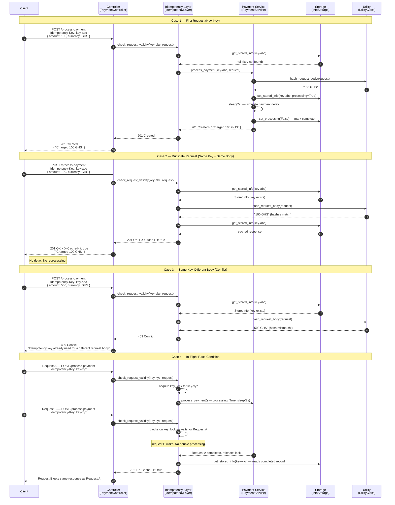

# Idempotency Gateway — Pay-Once Protocol

A production-quality REST API that guarantees payment requests are processed **exactly once**, even under network retries, timeouts, or concurrent duplicate submissions.

Built with **Python + FastAPI**. No external database required — pure in-memory storage.

---

## Architecture Diagram



---

## Project Structure

```
Idempotency-Gateway/
├── main.py                        # Entry point — wires all dependencies together
├── requirements.txt               # Python dependencies
├── Controller/
│   ├── __init__.py
│   └── PaymentController.py       # HTTP layer — defines POST /process-payment
├── Service/
│   ├── __init__.py
│   ├── IdempotencyLayer.py        # Core idempotency logic and decision making
│   └── PaymentService.py         # Payment processing simulation
├── Storage/
│   ├── __init__.py
│   └── InfoStorage.py            # In-memory key-value store (thread-safe)
├── DTOs/
│   ├── __init__.py
│   ├── PaymentRequest.py         # Request schema (amount, currency)
│   └── StoredInfo.py             # Stored record schema
└── Utility/
    ├── __init__.py
    └── Util.py                   # Request hashing + TTL background cleanup
```

Each layer has one responsibility:

| Layer | Responsibility |
|---|---|
| `Controller` | HTTP only — receives request, returns response |
| `IdempotencyLayer` | Decision engine — checks key, hash, state |
| `PaymentService` | Simulates payment processing |
| `Storage` | Thread-safe in-memory store |
| `DTOs` | Data shapes — request and stored record |
| `Utility` | Hashing and TTL expiry cleanup |

---

## Setup & Running

### Prerequisites

- Python 3.11+
- pip

### Install & Start

```bash
# 1. Clone the repo
git clone https://github.com/your-username/Idempotency-Gateway.git
cd Idempotency-Gateway

# 2. Install dependencies
pip install -r requirements.txt

# 3. Start the server
uvicorn main:app --reload
```

The server starts at **http://localhost:8000**

- Interactive API docs: http://localhost:8000/docs
- Health check: http://localhost:8000/health

---

## API Documentation

### `POST /process-payment`

Process a payment. Safe to retry — the payment will only be charged once.

**Headers**

| Header | Required | Description |
|---|---|---|
| `Idempotency-Key` | ✅ Yes | Unique string per payment (UUID recommended) |
| `Content-Type` | ✅ Yes | `application/json` |

**Request Body**

```json
{
  "amount": 100,
  "currency": "GHS"
}
```

| Field | Type | Rules |
|---|---|---|
| `amount` | number | Positive number |
| `currency` | string | Currency code e.g. GHS|

---

### Response Reference

#### `201 Created` — Payment processed (first request)

```json
"Charged 100 GHS"
```

#### `201 Created` — Cached replay (duplicate request, same body)

```json
"Charged 100 GHS"
```

Response header included:
```
X-Cache-Hit: true
```

> No 2-second delay. No reprocessing. Exact same response as the first request.

#### `409 Conflict` — Same key, different body

```json
"Idempotent request hash mismatch! Key already used"
```

---

### Example Requests

#### Case 1 — First payment (new key, takes ~2s)

```bash
curl -X POST http://localhost:8000/process-payment \
  -H "Idempotency-Key: key-abc-001" \
  -H "Content-Type: application/json" \
  -d '{"amount": 100, "currency": "GHS"}'
```

```
HTTP/1.1 201 Created
"Charged 100 GHS"
```

#### Case 2 — Retry (same key, same body — instant replay)

```bash
curl -si -X POST http://localhost:8000/process-payment \
  -H "Idempotency-Key: key-abc-001" \
  -H "Content-Type: application/json" \
  -d '{"amount": 100, "currency": "GHS"}'
```

```
HTTP/1.1 201 Created
X-Cache-Hit: true
"Charged 100 GHS"
```

#### Case 3 — Fraud attempt (same key, different amount)

```bash
curl -X POST http://localhost:8000/process-payment \
  -H "Idempotency-Key: key-abc-001" \
  -H "Content-Type: application/json" \
  -d '{"amount": 500, "currency": "GHS"}'
```

```
HTTP/1.1 409 Conflict
"Idempotent request hash mismatch! Key already used"
```

#### Case 4 — Race condition (two simultaneous requests)

```bash
curl -X POST http://localhost:8000/process-payment \
  -H "Idempotency-Key: race-key-001" \
  -H "Content-Type: application/json" \
  -d '{"amount": 250, "currency": "GHS"}' &

curl -X POST http://localhost:8000/process-payment \
  -H "Idempotency-Key: race-key-001" \
  -H "Content-Type: application/json" \
  -d '{"amount": 250, "currency": "GHS"}' &

wait
```

Both requests return the same `201` response. Only one payment is processed.

---

## Design Decisions

### 1. Threading Lock per Key

Each idempotency key gets its own `threading.Lock` inside `IdempotencyLayer`. A separate `_meta_lock` protects the dictionary of locks itself.

This means:
- Two requests with **different keys** run fully in parallel — no unnecessary blocking
- Two requests with the **same key** are serialised — the second waits for the first to complete, then reads the cached result

This is more efficient than a single global lock that would block all requests regardless of key.

### 2. Request Hashing in `UtilityClass`

Instead of storing and comparing the full request body, `Util.py` converts it to a compact string hash (`"100 GHS"`). This hash is what gets compared on duplicate requests. If the hashes differ, the request is rejected with `409 Conflict`.

### 3. `processing` Flag for In-Flight Detection

When `PaymentService` starts processing a payment, it immediately writes the record to storage with `processing=True` **before** the 2-second delay. This means any concurrent duplicate request that gets past the lock can still detect that processing is underway. Once the payment completes, the flag is set to `False`.

### 4. Layered Architecture

| Layer | What it knows | What it ignores |
|---|---|---|
| `Controller` | HTTP headers, status codes | Business logic |
| `IdempotencyLayer` | Keys, hashes, locks, state | HTTP, storage internals |
| `PaymentService` | Payment simulation, storage writes | HTTP, idempotency checks |
| `Storage` | Dictionary, thread safety | Everything else |

Adding a new feature only touches the relevant layer — nothing else changes.

---

## Developer's Choice Feature: Automatic TTL Key Expiry

**Feature:** Idempotency records automatically expire and are deleted after **1 hour** (3,600,000 ms).

**Why this matters for Fintech:**

In a real payment system, an idempotency key should only protect against retries within a short window — typically the duration of a client session or network timeout. Keeping keys forever would:

- Grow memory unbounded — a potential denial-of-service risk
- Prevent a legitimate future payment if the same key is accidentally reused days later
- Violate data minimisation principles relevant under regulations like GDPR and PCI-DSS

**How it works — Background Timer Cleanup:**

`UtilityClass` runs a background `threading.Timer` that fires every **120 seconds**. On each run, it scans the storage map and removes any record whose `created_at` timestamp is older than the TTL threshold. The timer is a **daemon thread**, meaning it automatically stops when the main application shuts down — no manual cleanup needed.

```
App starts → UtilityClass.__init__() → _schedule_cleanup()
                                              ↓
                                    threading.Timer(120s)
                                              ↓
                                    clean_expired_keys() → removes old records
                                              ↓
                                    _schedule_cleanup() → reschedules itself
```

The TTL is configurable in `Utility/Util.py`:

```python
EXPIRATION_TIME_MS: int = 3_600_000  # 1 hour — adjust to suit your retention policy
```

---

## Checklist

- ✅ `POST /process-payment` endpoint
- ✅ `Idempotency-Key` header required
- ✅ 2-second simulated processing delay on first request only
- ✅ Exact response replay on duplicate requests
- ✅ `X-Cache-Hit: true` header on cache hits
- ✅ `409 Conflict` on same key + different body
- ✅ In-flight race condition handling with per-key `threading.Lock`
- ✅ TTL-based automatic key expiry (Developer's Choice)
- ✅ No external database — pure in-memory storage
- ✅ No dependencies beyond `fastapi` and `uvicorn`